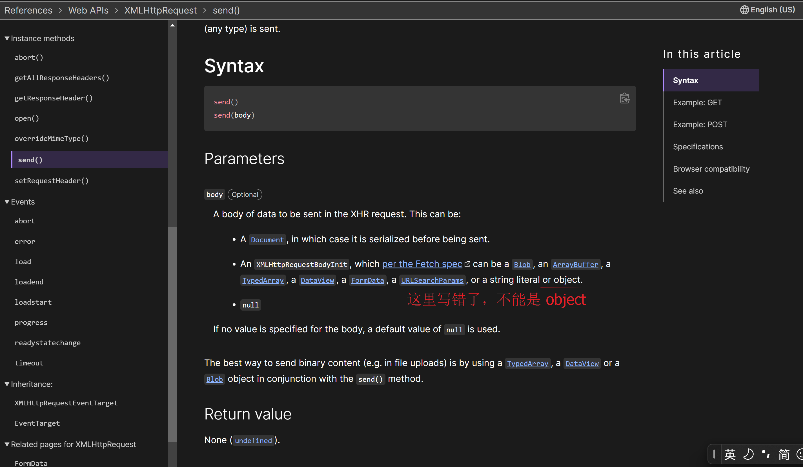

# 处理请求 body 数据

## 需求分析

我们通过执行 `XMLHttpRequest` 对象实例的 `send` 方法来发送请求，并通过该方法的参数设置请求 `body` 数据，我们可以去 [mdn](https://developer.mozilla.org/en-US/docs/Web/API/XMLHttpRequest/send) 查阅该方法支持的参数类型。

【MDN 的解释有个地方写错了】



我们发现 `send` 方法的参数支持 `Document` 和 `BodyInit` 类型，`BodyInit` 包括了 `Blob`, `BufferSource`, `FormData`, `URLSearchParams`, `ReadableStream`、`USVString`，当没有数据的时候，我们还可以传入 `null`。

【可以看下官方给的示例】

【[Example: GET](https://developer.mozilla.org/en-US/docs/Web/API/XMLHttpRequest/send#example_get)】

```js
const xhr = new XMLHttpRequest();
xhr.open('GET', '/server', true);

xhr.onload = () => {
  // Request finished. Do processing here.
};

xhr.send(null);
// xhr.send('string');
// xhr.send(new Blob());
// xhr.send(new Int8Array());
// xhr.send(document);
```

【[Example: POST](https://developer.mozilla.org/en-US/docs/Web/API/XMLHttpRequest/send#example_post)】

```js
const xhr = new XMLHttpRequest();
xhr.open("POST", '/server', true);

// Send the proper header information along with the request
xhr.setRequestHeader("Content-Type", "application/x-www-form-urlencoded");

xhr.onreadystatechange = () => { // Call a function when the state changes.
  if (xhr.readyState === XMLHttpRequest.DONE && xhr.status === 200) {
    // Request finished. Do processing here.
  }
}
xhr.send("foo=bar&lorem=ipsum");
// xhr.send(new Int8Array());
// xhr.send(document);
```

但是我们最常用的场景还是传一个普通对象给服务端，例如：

```typescript
axios({
  method: 'post',
  url: '/base/post',
  data: {
    a: 1,
    b: 2
  }
})
```

这个时候 `data`是不能直接传给 `send` 函数的，我们需要把它转换成 JSON 字符串。

## transformRequest 函数实现

根据需求分析，我们要实现一个工具函数，对 request 中的 `data` 做一层转换。我们在 `helpers` 目录新建 `data.ts` 文件。

`helpers/data.ts`：

```typescript
import { isPlainObject } from './util'

export function transformRequest (data: any): any {
  if (isPlainObject(data)) {
    return JSON.stringify(data)
  }
  return data
}
```

`helpers/util.js`：

```typescript
export function isPlainObject (val: any): val is Object {
  return toString.call(val) === '[object Object]'
}
```

这里为什么要使用 `isPlainObject` 函数判断，而不用之前的 `isObject` 函数呢，因为 `isObject` 的判断方式，对于 `FormData`、`ArrayBuffer` 这些类型，`isObject` 判断也为 `true`，但是这些类型的数据我们是不需要做处理的，而 `isPlainObject` 的判断方式，只有我们定义的普通 `JSON` 对象才能满足。

`helpers/url.ts`：

```typescript
if (isDate(val)) {
  val = val.toISOString()
} else if (isPlainObject(val)) {
  val = JSON.stringify(val)
}
```

对于上节课我们对请求参数值的判断，我们也应该用 `isPlainObject` 才更加合理。

`helpers/util.js`

```typescript
// export function isObject (val: any): val is Object {
//   return val !== null && typeof val === 'object'
// }
```

既然现在 `isObject` 方法不再使用，我们先将其注释。

## 实现请求 body 处理逻辑

`index.ts`：

```typescript
import { transformRequest } from './helpers/data'

function processConfig (config: AxiosRequestConfig): void {
  config.url = transformURL(config)
  config.data = transformRequestData(config)
}

function transformRequestData (config: AxiosRequestConfig): any {
  return transformRequest(config.data)
}
```

我们定义了 `transformRequestData` 函数，去转换请求 `body` 的数据，内部调用了我们刚刚实现的的 `transformRequest` 方法。

然后我们在 `processConfig` 内部添加了这段逻辑，在处理完 url 后接着对 `config` 中的 `data` 做处理。

## 编写 demo

```typescript
createButton('处理 data：对象', () => {
  axios({
    method: 'post',
    url: '/base/post',
    data: {
      a: 1,
      b: 2
    }
  })
})

createButton('处理 data：Int32Array', () => {
  const arr = new Int32Array([21, 31])

  axios({
    method: 'post',
    url: '/base/buffer',
    data: arr
  })
})
```

我们在 `examples/base/app.ts` 添加 2 段代码，第一个 post 请求的 `data` 是一个普通对象，第二个请求的 `data` 是一个 `Int32Array` 类型的数据，它是可以直接传给 `XMLHttpRequest` 对象的 `send` 方法的。

```javascript
router.post('/base/post', function(req, res) {
  res.json(req.body)
})

router.post('/base/buffer', function(req, res) {
  let msg = []
  req.on('data', (chunk) => {
    if (chunk) {
      msg.push(chunk)
    }
  })
  req.on('end', () => {
    let buf = Buffer.concat(msg)
    res.json(buf.toJSON())
  })
})
```

我们接着在 `examples/server.js` 中添加 2 个路由，分别针对这俩种请求，返回请求传入的数据。

然后我们打开浏览器运行 demo，看一下结果，我们发现 `/base/buffer` 的请求是可以拿到数据，但是 `base/post` 请求的 response 里却返回的是一个空对象，这是什么原因呢？

实际上是因为我们虽然执行 `send` 方法的时候把普通对象 `data` 转换成一个 `JSON` 字符串，但是我们请求`header` 的 `Content-Type` 是 `text/plain;charset=UTF-8`，导致了服务端接受到请求并不能正确解析请求 `body` 的数据。

知道这个问题后，下面一节课我们来实现对请求 `header` 的处理。
