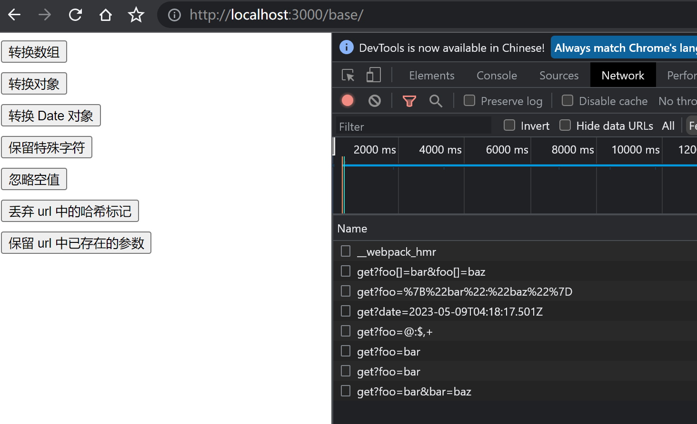

# 处理请求 url 参数

## 需求分析

还记得我们上节课遗留了一个问题，再来看这个例子：

```typescript
axios({
  method: 'get',
  url: '/base/get',
  params: {
    a: 1,
    b: 2
  }
})
```

我们希望最终请求的 `url` 是 `/base/get?a=1&b=2`，这样服务端就可以通过请求的 url 解析到我们传来的参数数据了。实际上就是把 `params` 对象的 key 和 value 拼接到 `url` 上。

再来看几个更复杂的例子。

### 参数值为数组

```typescript
axios({
  method: 'get',
  url: '/base/get',
  params: {
    foo: ['bar', 'baz']
  }
})
```

最终请求的 `url` 是 `/base/get?foo[]=bar&foo[]=baz'`。

### 参数值为对象

```typescript
axios({
  method: 'get',
  url: '/base/get',
  params: {
    foo: {
      bar: 'baz'
    }
  }
})
```

最终请求的 `url` 是 `/base/get?foo=%7B%22bar%22:%22baz%22%7D`，`foo` 后面拼接的是 `{"bar":"baz"}` encode 后的结果。

### 参数值为 Date 类型

```typescript
const date = new Date()

axios({
  method: 'get',
  url: '/base/get',
  params: {
    date
  }
})
```

最终请求的 `url` 是 `/base/get?date=2019-04-01T05:55:39.030Z`，`date` 后面拼接的是 `date.toISOString()` 的结果。

### 特殊字符支持

对于字符 `@`、`:`、`$`、`,`、` `、`[`、`]`，我们是允许出现在 `url` 中的，不希望被 encode。


```typescript
axios({
  method: 'get',
  url: '/base/get',
  params: {
    foo: '@:$, '
  }
})
```

最终请求的 `url` 是 `/base/get?foo=@:$+`，注意，我们会把空格 ` ` 转换成 `+`。

### 空值忽略

对于值为 `null` 或者 `undefined` 的属性，我们是不会添加到 url 参数中的。

```typescript
axios({
  method: 'get',
  url: '/base/get',
  params: {
    foo: 'bar',
    baz: null
  }
})
```

最终请求的 `url` 是 `/base/get?foo=bar`。

### 丢弃 url 中的哈希标记

```typescript
axios({
  method: 'get',
  url: '/base/get#hash',
  params: {
    foo: 'bar'
  }
})
```

最终请求的 `url` 是 `/base/get?foo=bar`

### 保留 url 中已存在的参数

```typescript
axios({
  method: 'get',
  url: '/base/get?foo=bar',
  params: {
    bar: 'baz'
  }
})
```

最终请求的 `url` 是 `/base/get?foo=bar&bar=baz`


## buildURL 函数实现

根据我们之前的需求分析，我们要实现一个工具函数，把 `params` 拼接到 `url` 上。我们希望把项目中的一些工具函数、辅助方法独立管理，于是我们创建一个 `helpers` 目录，在这个目录下创建 `url.ts` 文件，未来会把处理 `url` 相关的工具函数都放在该文件中。

`helpers/url.ts`：

```typescript
import { isDate, isObject } from './util'

/**
 * @description 保留特殊字符 \@ : $ , [ ]
 *
 * 空格会被转为 +
 */
function encode(val: string): string {
  return encodeURIComponent(val)
    .replace(/%40/g, '@')
    .replace(/%3A/gi, ':')
    .replace(/%24/g, '$')
    .replace(/%2C/gi, ',')
    .replace(/%20/g, '+')
    .replace(/%5B/gi, '[')
    .replace(/%5D/gi, ']')
}

/**
 * @description 把 params 拼接到 url 上
 * @example
 * axios({
 *   method: 'get',
 *   url: '/base/get',
 *   params: {
 *     a: 1,
 *     b: 2
 *   }
 * })
 * // 拼接为
 * /base/get?a=1&b=2
 *
 * { foo: ['bar', 'baz'] }
 * // 数组需要拼接为
 * /base/get?foo[]=bar&foo[]=baz'
 *
 * { foo: { bar: 'baz' } }
 * // 对象需要拼接为（encode 之后的结果）
 * /base/get?foo=%7B%22bar%22:%22baz%22%7D
 *
 * const date = new Date()
 * { date }
 * // 日期需要拼接为 date.toISOString()
 * /base/get?date=2023-05-09T03:37:20.151Z
 *
 * { foo: '@:$, ' }
 * // 允许特殊字符 \@、:、$、,、、[、] 出现在 url 中，而不被 encode。注意：空格会被转为 +
 * // 上一行的 \at 符号实际不需要前面的反斜杠，at 符号在注释中有特殊含义，需要加个反斜杠转义一下
 * /base/get?foo=@:$+
 *
 * { foo: 'bar', baz: null }
 * // 忽略空值 null、undefined
 * /base/get?foo=bar
 *
 * axios({
 *   method: 'get',
 *   url: '/base/get#hash',
 *   params: {
 *     foo: 'bar'
 *   }
 * })
 * // 丢弃 url 中的哈希标记
 * /base/get?foo=bar
 *
 * axios({
 *   method: 'get',
 *   url: '/base/get?foo=bar',
 *   params: {
 *     bar: 'baz'
 *   }
 * })
 * // 保留 url 中已存在的参数
 * /base/get?foo=bar&bar=baz
 */
export function buildURL(url: string, params?: any): string {
  if (!params) {
    return url
  }

  const parts: string[] = []

  Object.keys(params).forEach((key) => {
    let val = params[key]
    // 忽略空值
    if (val === null || val === undefined) {
      return
    }
    let values: string[]
    // 处理数组
    if (Array.isArray(val)) {
      values = val
      key += '[]'
    } else {
      values = [val]
    }
    values.forEach((val) => {
      // 处理 Date 对象
      if (isDate(val)) {
        val = val.toISOString()
      } else if (isObject(val)) {
        // 处理对象
        val = JSON.stringify(val)
      }
      parts.push(`${encode(key)}=${encode(val)}`)
    })
  })

  // 多个参数时需要通过 & 拼接
  let serializedParams = parts.join('&')

  if (serializedParams) {
    const markIndex = url.indexOf('#')
    if (markIndex !== -1) {
      // 丢弃 url 中的哈希标记
      url = url.slice(0, markIndex)
    }

    // 保留 url 中已存在的参数
    url += (url.indexOf('?') === -1 ? '?' : '&') + serializedParams
  }

  return url
}
```

`helpers/util.ts`：

```typescript
const toString = Object.prototype.toString

export function isDate(val: any): val is Date {
  return toString.call(val) === '[object Date]'
}

export function isObject(val: any): val is Object {
  return val !== null && typeof val === 'object'
}

```

## 实现 url 参数处理逻辑

我们已经实现了 `buildURL` 函数，接下来我们来利用它实现 `url` 参数的处理逻辑。

在 `index.ts` 文件中添加如下代码：

```typescript
function axios(config: AxiosRequestConfig): void {
  processConfig(config)
  xhr(config)
}

function processConfig(config: AxiosRequestConfig): void {
  config.url = transformUrl(config)
}

function transformUrl(config: AxiosRequestConfig): string {
  const { url, params } = config
  return buildURL(url, params)
}
```

在执行 `xhr` 函数前，我们先执行 `processConfig` 方法，对 `config` 中的数据做处理，除了对 `url` 和 `params` 处理之外，未来还会处理其它属性。

在 `processConfig` 函数内部，我们通过执行 `transformUrl` 函数修改了 `config.url`，该函数内部调用了 `buildURL`。

那么至此，我们对 `url` 参数处理逻辑就实现完了，接下来我们就开始编写 demo 了。

## demo 编写

在 `examples` 目录下创建 `base` 目录，在 `base` 目录下创建 `index.html`:

```html
<!DOCTYPE html>
<html lang="en">
  <head>
    <meta charset="utf-8">
    <title>Base example</title>
  </head>
  <body>
    <script src="/__build__/base.js"></script>
  </body>
</html>
```

接着创建 `app.ts` 作为入口文件：

```typescript
import axios from '../../src/index'
import createButton from '../create-button'

createButton('转换数组', () => {
  axios({
    method: 'get',
    url: '/base/get',
    params: {
      foo: ['bar', 'baz']
    }
  })
})

createButton('转换对象', () => {
  axios({
    method: 'get',
    url: '/base/get',
    params: {
      foo: {
        bar: 'baz'
      }
    }
  })
})

createButton('转换 Date 对象', () => {
  const date = new Date()
  axios({
    method: 'get',
    url: '/base/get',
    params: {
      date
    }
  })
})

createButton('保留特殊字符', () => {
  axios({
    method: 'get',
    url: '/base/get',
    params: {
      foo: '@:$, '
    }
  })
})

createButton('忽略空值', () => {
  axios({
    method: 'get',
    url: '/base/get',
    params: {
      foo: 'bar',
      baz: null
    }
  })
})

createButton('丢弃 url 中的哈希标记', () => {
  axios({
    method: 'get',
    url: '/base/get#hash',
    params: {
      foo: 'bar'
    }
  })
})

createButton('保留 url 中已存在的参数', () => {
  axios({
    method: 'get',
    url: '/base/get?foo=bar',
    params: {
      bar: 'baz'
    }
  })
})
```

【`/examples/create-button.ts`】

```ts
export default function createButton (text: string, onClick: () => void): void {
  const button = document.createElement('button')
  button.innerText = text
  button.setAttribute('style', 'display: block; margin-bottom: 10px;')
  button.addEventListener('click', onClick)
  document.body.appendChild(button)
}
```

接着在 `server.js` 添加新的接口路由：

```typescript
router.get('/base/get', function(req, res) {
  res.json(req.query)
})
```

且需要在 `examples/index.html` 中添加新的链接

```html
<!--  -->
      <li><a href="base">Base</a></li>
<!--  -->
```

然后在命令行运行 `npm run dev`，接着打开 chrome 浏览器，访问 `http://localhost:8080/` 即可访问我们的 demo 了，我们点到 `Base` 目录下，逐个点击按钮，通过开发者工具的 network 部分可以看到成功发送的请求，并可以观察它们最终请求的 url，已经如期添加了请求参数。



那么至此我们的请求 `url` 参数处理编写完了，下一小节我们会对 `request body` 数据做处理。
